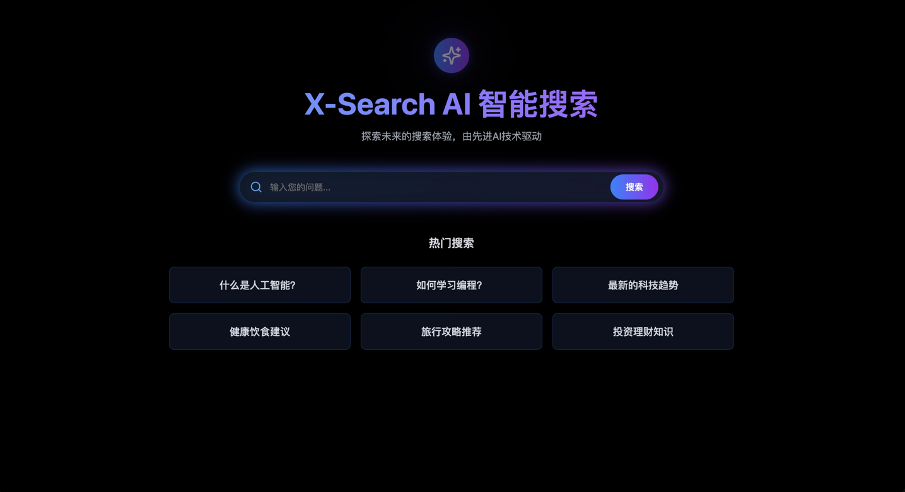
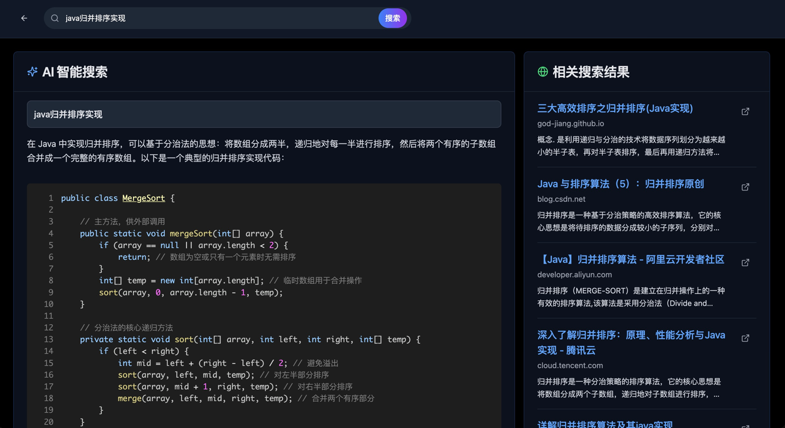

# X-Search AI智能搜索
X-Search使用Spring AI和Spring AI Alibab Graph实现的AI智能搜索系统。
## 核心功能




## 快速开始

```shell
git clone https://github.com/renpengben/x-search.git 
```
1.申请searchapi key https://www.searchapi.io/

2.修改配置
```yaml

spring:
  application:
    name: x-search
  ai:
    openai:
      base-url: https://dashscope.aliyuncs.com/compatible-mode
      api-key:  sk-xxx
      chat:
        options:
          model: qwen-max-latest
      embedding:
        options:
          model: text-embedding-v1
keys:
  searchapi:
    key: xxx
    engine: google

logging:
  level:
    org:
      springframework:
        ai:
          chat:
            client:
              advisor: DEBUG
server:
  port: 8888
```
3.后端运行 XSearchApplication.java
4.前端运行
```shell
cd /x-search-ui

npm install

npm run dev
```